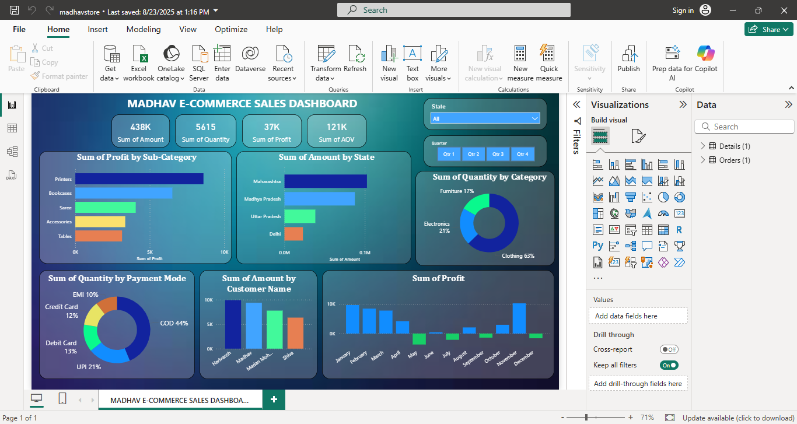

# 📊 Madhav E-Commerce Sales Dashboard (Power BI)

This project is an interactive **Sales Dashboard** built using **Microsoft Power BI**.  
It provides insights into sales, profit, quantity, customer behavior, and regional performance.  

---

## 🚀 Features
- ✅ Sales Overview: Total Sales Amount, Quantity, Profit, and Average Order Value (AOV)  
- ✅ Profit by Sub-Category (Printers, Bookcases, Sarees, Accessories, etc.)  
- ✅ Sales by State (Maharashtra, Madhya Pradesh, Uttar Pradesh, Delhi)  
- ✅ Category-Wise Sales Distribution (Furniture, Electronics, Clothing)  
- ✅ Payment Mode Analysis (UPI, Debit Card, Credit Card, COD, EMI)  
- ✅ Customer-Wise Sales Contribution  
- ✅ Monthly Profit Trends  

---

## 🛠 Tools Used
- Microsoft Power BI  
- Dataset: *Public e-commerce sales dataset*  

---

## 📊 Dataset  
🔗 [Original Dataset Source](https://drive.google.com/drive/folders/1mY0agiWajOKDelUjIAADWMbB0q6kSz2p)  

---

## 📷 Dashboard Preview

---

## 📂 Files in Repository
- `Madhav_Ecommerce_Sales_Dashboard.pbix` → Power BI dashboard file  
- `screenshot.png` → Dashboard preview  
- `README.md` → Project documentation  

---

## 📌 How to Use
1. Download the `.pbix` file.  
2. Open it in **Power BI Desktop**.  
3. Explore the interactive dashboard.  

---

## ⚠️ Note
- The dataset is **public and used for learning purposes only**.  
- All insights are based on this sample dataset and do not represent real company data.  
